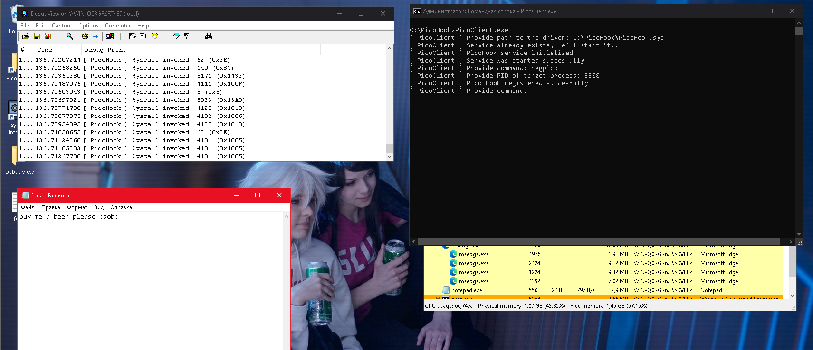

# PicoHook

**PicoHook** is a small driver that uses a system of alternative syscalls and their handlers. **The project is still under development.**

## What are alternative syscalls?

**Alternate syscalls** are a mechanism for Pico processes that exist to support WSLs. The system initially has one registered handler for Pico processes. Alternate syscall handlers can receive all syscalls from a particular process.

## How can it be useful?

Technically, we can intercept syscalls from a particular process. Or monitor a specific process and what syscalls it uses.

## Are there any restrictions?

Yes, I do. First, we can only monitor one process. Secondly, Windows allows registering only one handler, if you try to register a third or more handler, the system will crash with bug `0x1E0` (`INVALID_ALTERNATE_SYSTEM_CALL_HANDLER_REGISTRATION`). 
All handlers (2) can be found in the `PsAltSystemCallHandlers` array. Also, the `PsAltSystemCallHandlers` array is monitored by **Patchguard**.

In order to work properly on a real system, we **must** initialize our own handler before **Patchguard** is initialized. The second option is the **Patchguard** initialization patch.

## Compiling

MSVC v143 and VS2022 are used to build the project. You can also build the project on a compiler version older than v143.

## Usage

```
regpico - registers Pico handler (only one per OS session)
unregpico - deletes Pico handler
picohelp - shows this message
picodel - terminates Pico service
exitpico - exits from PoC
```

## TODO

- Implement interceptions of certain syscalls.
- Implement deactivation of alternate syscalls processing for a specific process.
- Understand how to re-register handlers.



### Credits

[0x00Alchemist](https://github.com/0x00Alchemist) (2024)